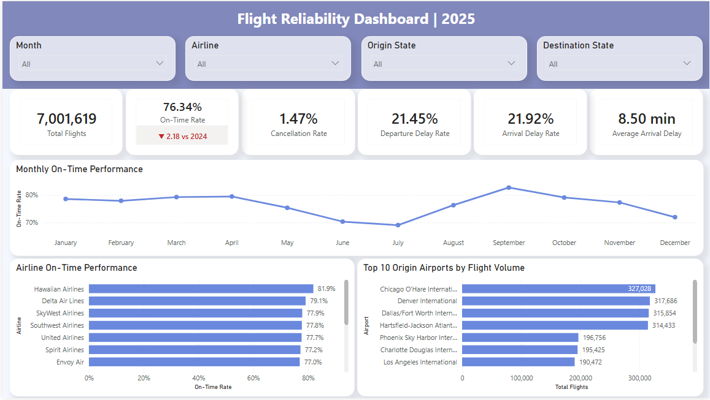
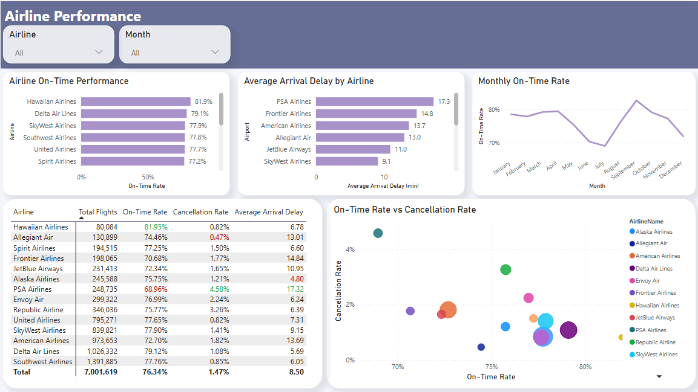
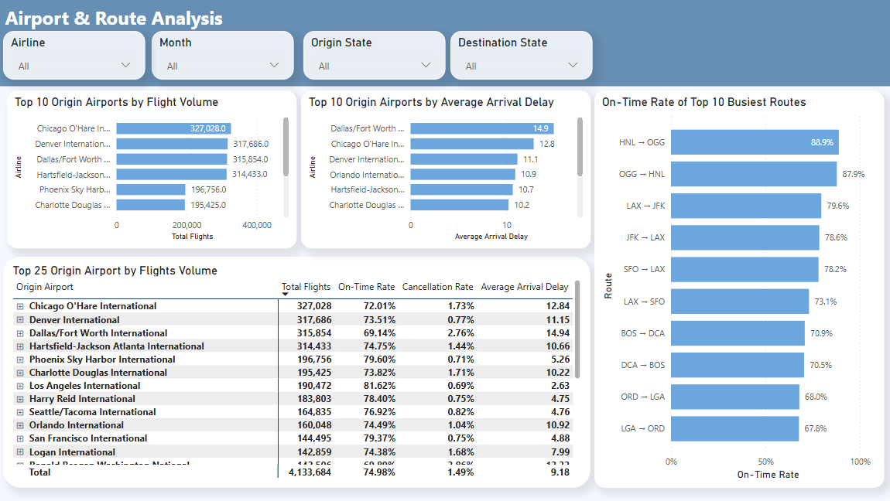
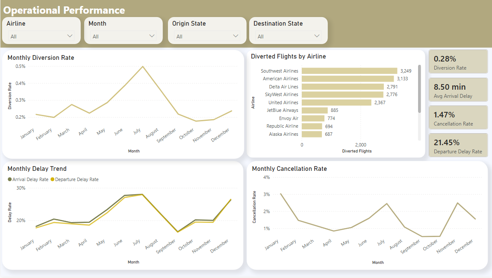

# Flight Reliability Intelligence System

End-to-end Data Analytics portfolio project for U.S. flight reliability, built with Python, SQL Server, and Power BI.

The system analyzes airlines, airports, routes, dates, and flight schedules to identify patterns in delays, on-time performance, cancellations, diversions, and airline / airport / route reliability.

## Objective

Build a professional analytics workflow using official flight-level data from the U.S. Bureau of Transportation Statistics (BTS), rather than a pre-built Kaggle dataset.

The project follows a realistic Business Intelligence workflow:

1. Extract official monthly BTS flight data.
2. Clean, validate, and standardize the data with Python.
3. Load the processed monthly files into SQL Server staging tables.
4. Build a dimensional Star Schema.
5. Validate the final Data Warehouse.
6. Connect the analytical model to Power BI.
7. Build DAX measures, KPIs, dashboards, and business insights.

## Architecture

```text
U.S. Bureau of Transportation Statistics
        ↓
12 Monthly Raw BTS CSV Files
        ↓
Python ETL
        ↓
Cleaning / Validation / Type Conversion
        ↓
12 Processed Monthly CSV Files
        ↓
SQL Server
        ↓
12 Monthly Staging Tables
        ↓
Dimensional Model
        ↓
Dimension Tables + Fact Table
        ↓
Data Validation
        ↓
Power BI
        ↓
DAX Measures / KPIs
        ↓
Interactive Dashboards
        ↓
Business Insights
```

## Technology Stack

- Python
- Pandas
- SQL Server
- T-SQL
- Power BI
- DAX
- Git / GitHub

## Responsibility Split

### Python

Python is responsible for the ETL process before the data reaches SQL Server:

- Read the 12 original monthly BTS CSV files.
- Combine the monthly data for transformation and validation.
- Convert flight dates.
- Convert BTS HHMM clock-time fields into valid time values.
- Convert integer-like numerical fields into SQL-compatible integer values.
- Validate the processed dataset.
- Split the processed data back into monthly datasets.
- Export 12 cleaned monthly CSV files.

### SQL Server

SQL Server is responsible for:

- Creating the project database.
- Creating the staging, dimension, fact, and analytics schemas.
- Loading the 12 processed monthly CSV files.
- Creating the dimensional model.
- Generating surrogate keys.
- Populating dimensions.
- Populating the flight fact table.
- Enforcing keys, relationships, and uniqueness constraints.
- Running final Data Warehouse validation.

### Power BI

Power BI is responsible for:

- Semantic modeling.
- DAX measures.
- KPIs.
- Interactive reporting.
- Reliability analysis.
- Business insights.

## SQL Server Schemas

| Schema | Responsibility |
| --- | --- |
| `staging` | Landing layer for the cleaned Python ETL output |
| `dim` | Analytical dimension tables |
| `fact` | Flight-level fact tables |
| `analytics` | Reusable analytical SQL views and reporting logic |

The project intentionally does not use a SQL Server `raw` schema.

The original BTS data is retained in the file system, while Python performs the extraction, cleaning, validation, and type-conversion steps before SQL Server receives the data.

## Data Source

The project uses official U.S. flight-level data from the **U.S. Bureau of Transportation Statistics (BTS)**.

- **Dataset:** Airline On-Time Performance Data
- **Period:** January 2025 - December 2025
- **Processed flight records:** 7,001,619
- **Raw and processed full-size datasets are intentionally excluded from GitHub because of their size.**
- The repository contains the ETL and SQL pipeline required to reproduce the analytical dataset from the official source.

[View the official BTS data source](https://www.bts.gov/browse-statistical-products-and-data/bts-publications/airline-service-quality-performance-234-time)

## Sample Data

The complete 2025 dataset contains more than 7 million flight records and is intentionally not stored in this repository because of its size.

To make the project easier to inspect, the repository includes a representative sample of the processed flight data:

[`data/samples/flights_2025_sample.csv`](data/samples/flights_2025_sample.csv)

The sample contains approximately 10,000 records selected from the cleaned 2025 monthly datasets and demonstrates the structure and content of the data used by the SQL Server and Power BI layers.

The full analytical dataset can be reproduced from the official BTS source files using the Python ETL pipeline included in this repository.

## Reference Data

The repository also includes small reference / mapping datasets used to translate technical codes into business-friendly labels for analysis and reporting.

These reference files support mappings such as:

- Airline carrier code → airline name
- Airport code → airport descriptive information

Because these files are small and help make the analytical model easier to understand and reproduce, they are intended to remain version-controlled in the repository.

Reference files are stored under:

```text
data/reference/
```

Unlike the full raw and processed flight datasets, these mapping files are suitable for GitHub and provide useful context for the SQL and Power BI reporting layers.
## Development Notebooks

The repository includes three Jupyter notebooks that document the main development and validation stages of the Python workflow.

### `01_extract_bts_2025.ipynb`

Extract-stage notebook used to locate and verify the 12 monthly BTS files for 2025, confirm that their column structures are compatible, load the monthly files, combine them into a single yearly DataFrame, and validate the resulting row counts, year coverage, and month coverage before export.

This notebook intentionally avoids cleaning or transforming the data so that extraction and transformation remain separate stages.

### `02_data_quality_and_cleaning.ipynb`

Transform-stage notebook used for data profiling, quality checks, type decisions, and approved cleaning steps.

The notebook follows the workflow:

```text
Inspect → Identify → Understand → Decide → Transform → Validate
```

It rebuilds the yearly dataset from the 12 monthly source files, inspects the data before modification, applies the approved transformations such as date and BTS HHMM time conversion, validates the results, and exports the 12 cleaned monthly files used by SQL Server.

### `03_VALIDATION_NOTEBOOK.IPYNB`

Lightweight validation and utility notebook used after the processed files were created.

It is used to inspect the cleaned output, verify selected exported values and data representation, and generate the repository sample dataset from all 12 processed monthly files.

The sample is written to:

```text
data/samples/flights_2025_sample.csv
```

This notebook is intentionally small because the main production transformation logic is implemented in the ETL script and the second notebook.

## Python ETL

The executable ETL process is implemented in:

```text
python/etl_flights.py
```

The development notebooks are used for investigation, profiling, validation, and transformation decisions.

The Python ETL exports:

```text
2025_01_clean.csv
2025_02_clean.csv
...
2025_12_clean.csv
```

The processed files contain 62 selected flight-level fields and are prepared for direct loading into SQL Server.

### Important transformations

Examples of transformations performed before SQL Server loading include:

```text
FL_DATE
→ standardized flight date

CRS_DEP_TIME
DEP_TIME
WHEELS_OFF
WHEELS_ON
CRS_ARR_TIME
ARR_TIME
→ BTS HHMM values converted to HH:MM

Integer-like numerical fields
→ exported without unnecessary decimal values
```

The SQL Server staging layer therefore receives already-cleaned and correctly formatted data.

## Staging Layer

SQL Server contains one staging table for each month:

```text
staging.Flights_2025_01
staging.Flights_2025_02
...
staging.Flights_2025_12
```

All 12 tables share the same 62-column structure.

The staging layer represents the validated output of the Python ETL process and serves as the source for the dimensional model.

## Dimensional Model

The analytical model uses a Star Schema.

### Dimensions

```text
dim.Date
dim.Airline
dim.Airport
```

### Fact table

```text
fact.Flights
```

Conceptually:

```text
                    dim.Date
                       │
                       │
                       ▼
dim.Airline ─────► fact.Flights ◄───── dim.Airport
                                      ▲           ▲
                                      │           │
                                   Origin    Destination
```

## Dimension Tables

### `dim.Date`

Contains one row per calendar date.

For the current 2025 dataset:

```text
365 rows
2025-01-01 → 2025-12-31
```

Attributes include:

- Year
- Quarter
- Quarter Name
- Month
- Month Name
- Year-Month
- Day of Month
- Day of Week
- Day Name
- Weekend flag

`DateKey` uses the `YYYYMMDD` warehouse key format.

Example:

```text
2025-01-01 → 20250101
```

### `dim.Airline`

Contains one row per DOT airline.

Current dimension size:

```text
14 airlines
```

Business key:

```text
DOTAirlineID
```

Surrogate key:

```text
AirlineKey
```

### `dim.Airport`

Contains one row per airport.

Current dimension size:

```text
352 airports
```

Business key:

```text
AirportID
```

Surrogate key:

```text
AirportKey
```

`dim.Airport` is a role-playing dimension.

`fact.Flights` references the same airport dimension twice:

```text
OriginAirportKey
DestinationAirportKey
```

A separate Route dimension is not required.

A route is represented by:

```text
OriginAirportKey + DestinationAirportKey
```

## Fact Table

The central analytical table is:

```text
fact.Flights
```

The current fact table contains:

```text
7,001,619 flight records
```

### Fact Grain

One row represents one scheduled flight occurrence:

```text
Flight Date
+ Airline
+ Flight Number
+ Origin Airport
+ Destination Airport
+ Scheduled Departure Time
```

The original business-key definition is:

```text
FL_DATE
+ OP_CARRIER_AIRLINE_ID
+ OP_CARRIER_FL_NUM
+ ORIGIN_AIRPORT_ID
+ DEST_AIRPORT_ID
+ CRS_DEP_TIME
```

The warehouse uniqueness constraint is implemented using:

```text
DateKey
+ AirlineKey
+ FlightNumber
+ OriginAirportKey
+ DestinationAirportKey
+ ScheduledDepTime
```

This grain was validated across the complete 2025 dataset and no duplicate grain combinations were found.

### Surrogate Key

Each fact row receives:

```text
FlightKey
```

as a `BIGINT IDENTITY` surrogate primary key.

### Fact Measures

The fact table includes measures such as:

- Departure delay minutes
- Arrival delay minutes
- Non-negative departure delay
- Non-negative arrival delay
- Taxi-out time
- Taxi-in time
- Scheduled elapsed time
- Actual elapsed time
- Air time
- Flight distance
- Carrier delay
- Weather delay
- NAS delay
- Security delay
- Late aircraft delay
- Diversion measures

It also contains flight-level status flags including:

- Cancellation
- Diversion
- Departure delay of 15+ minutes
- Arrival delay of 15+ minutes

## Repository Structure

```text
Flight-Reliability-Intelligence/
│
├── data/
│   ├── raw/
│   │   └── bts/
│   │       ├── description/
│   │       └── 2025/
│   │           ├── 2025_01.csv
│   │           ├── ...
│   │           └── 2025_12.csv
│   │
│   └── processed/
│       ├── 2025_01_clean.csv
│       ├── ...
│       └── 2025_12_clean.csv
│
├── python/
│   └── etl_flights.py
│
├── notebooks/
│   ├── 01_extract_bts_2025.ipynb
│   ├── 02_data_quality_and_cleaning.ipynb
│   └── 03_VALIDATION_NOTEBOOK.IPYNB
│
├── sql/
│   ├── 01_Create_Database_And_Schemas.sql
│   ├── 02_Create_Staging_Layer.sql
│   ├── 03_Load_Staging_Data.sql
│   ├── 04_Create_Dimensional_Model.sql
│   ├── 05_Load_Dimensions.sql
│   ├── 06_Load_FactFlights.sql
│   ├── 07_Data_Validation.sql
│   └── analytics/
│
├── powerbi/
│   └── README.md
│
├── docs/
│   └── powerbi/
│       └── screenshots/
│           ├── 01_executive_overview.png
│           ├── 02_airline_performance.png
│           ├── 03_airport_route_analysis.png
│           └── 04_operational_performance.png
│
├── README.md
└── .gitignore
```

Large source and processed datasets are excluded from Git.

## SQL Script Order

SQL scripts are executed in the following order:

```text
01_Create_Database_And_Schemas.sql
        ↓
02_Create_Staging_Layer.sql
        ↓
03_Load_Staging_Data.sql
        ↓
04_Create_Dimensional_Model.sql
        ↓
05_Load_Dimensions.sql
        ↓
06_Load_FactFlights.sql
        ↓
07_Data_Validation.sql
```

### `01_Create_Database_And_Schemas.sql`

Creates:

```text
FlightReliabilityIntelligence
```

and the schemas:

```text
staging
dim
fact
analytics
```

### `02_Create_Staging_Layer.sql`

Creates the 12 monthly staging tables:

```text
staging.Flights_2025_01
...
staging.Flights_2025_12
```

All monthly tables use the same structure.

### `03_Load_Staging_Data.sql`

Loads the 12 cleaned CSV files produced by Python into their matching staging tables using SQL Server bulk loading.

The script also validates:

- Row counts
- Minimum flight date
- Maximum flight date
- Expected calendar month
- Expected calendar year

### `04_Create_Dimensional_Model.sql`

Creates:

```text
dim.Date
dim.Airline
dim.Airport
fact.Flights
```

including:

- Primary keys
- Surrogate keys
- Foreign keys
- Uniqueness constraints
- Analytical indexes

### `05_Load_Dimensions.sql`

Populates:

```text
dim.Date
dim.Airline
dim.Airport
```

Surrogate keys are generated for airlines and airports.

The airport dimension is populated from both origin and destination airport data.

### `06_Load_FactFlights.sql`

Loads all 12 monthly staging datasets into:

```text
fact.Flights
```

During the load, the script resolves:

```text
FL_DATE
→ DateKey

OP_CARRIER_AIRLINE_ID
→ AirlineKey

ORIGIN_AIRPORT_ID
→ OriginAirportKey

DEST_AIRPORT_ID
→ DestinationAirportKey
```

The script validates all dimension lookups before loading the fact table.

### `07_Data_Validation.sql`

Runs final Data Warehouse validation.

Checks include:

- Staging row count vs. fact row count
- Dimension business-key uniqueness
- Fact grain uniqueness
- Referential integrity
- Required field NULL validation
- Date coverage
- Monthly staging-to-fact reconciliation
- Flight date range validation

The script does not modify project data.

## Final SQL Validation Results

The complete 2025 dataset passed the final SQL validation process.

### Row reconciliation

```text
Staging rows: 7,001,619
Fact rows:    7,001,619
Difference:   0
```

### Dimension sizes

```text
dim.Date:     365
dim.Airline:   14
dim.Airport:  352
```

### Referential integrity

```text
Missing Date Keys:                0
Missing Airline Keys:             0
Missing Origin Airport Keys:      0
Missing Destination Airport Keys: 0
```

### Grain validation

```text
Duplicate fact-grain records: 0
```

### Date coverage

```text
Minimum Flight Date: 2025-01-01
Maximum Flight Date: 2025-12-31
```

### Flight status summary

```text
Total Flights:                 7,001,619
Cancelled Flights:               102,876
Diverted Flights:                 19,258
Departure Delayed 15+ Flights: 1,501,825
Arrival Delayed 15+ Flights:   1,534,638
```

The SQL Data Warehouse is therefore validated and ready for the Power BI stage.

## End-to-End Data Flow

```text
BTS Monthly CSV Files
        ↓
Python ETL
        ↓
12 Cleaned Monthly CSV Files
        ↓
12 SQL Server Staging Tables
        ↓
dim.Date
dim.Airline
dim.Airport
        ↓
fact.Flights
        ↓
SQL Data Validation
        ↓
Power BI
```

## Power BI Reporting Layer

The Power BI stage is complete and serves as the final analytical presentation layer of the project.

The report connects the validated SQL Server dimensional model to an interactive semantic model, reusable DAX measures, KPI cards, slicers, ranking logic, conditional formatting, and four focused report pages.

### Power BI semantic model

The SQL model is consumed as a star schema centered on:

```text
fact Flights
```

with the main reporting dimensions:

```text
dim Date
dim Airline
dim Origin Airport
dim Destination Airport
```

The airport model required special handling because every flight has two airport roles: origin and destination.

The original SQL warehouse stores a single role-playing `dim.Airport`. In Power BI, that source was referenced twice to create two logical reporting dimensions:

```text
dim Origin Airport
dim Destination Airport
```

This allows both airport relationships to remain active and makes filters such as **Origin State** and **Destination State** straightforward for report users.

The date dimension was also marked as the model's official Date Table, and month names were sorted by the numeric month column to preserve chronological order in time-series visuals.

### Core DAX measures

Reusable measures were created for the main reliability KPIs, including:

```text
Total Flights
On-Time Flights
On-Time Rate
Cancelled Flights
Cancellation Rate
Diverted Flights
Diversion Rate
Departure Delayed 15+ Flights
Arrival Delayed 15+ Flights
Departure Delay Rate
Arrival Delay Rate
Average Departure Delay
Average Arrival Delay
```

For this report, an on-time flight is defined as a flight that:

```text
was not cancelled
AND was not diverted
AND arrived less than 15 minutes late
```

Measures are evaluated dynamically under Power BI filter context, so the same KPI logic responds to selections such as airline, month, origin state, and destination state.

### Measure organization

Business measures are kept separate from presentation logic.

A dedicated formatting-measures table is used for helper calculations such as:

```text
Dynamic colors
Trend colors
Conditional-formatting logic
Dynamic labels
```

This keeps analytical calculations easier to maintain and prevents formatting-specific DAX from cluttering the main KPI measure table.

### Conditional formatting

The airline and airport matrices use targeted conditional formatting rather than coloring every cell.

Examples:

```text
On-Time Rate
Highest → Green
Lowest  → Red

Cancellation Rate
Lowest  → Green
Highest → Red

Average Arrival Delay
Lowest  → Green
Highest → Red
```

The formatting measures use `ALLSELECTED()` so the minimum and maximum values are calculated across the currently visible population while still respecting report slicers.

### Dynamic 2025 vs 2024 benchmark

The Executive Overview contains a 2025 On-Time Rate comparison against a 2024 benchmark.

A specific UX safeguard was added: the prior-year comparison is shown only in the unfiltered overall view.

If the user filters by month, airline, origin state, or destination state, the comparison returns `BLANK()`.

This prevents an overall 2024 value from being presented as if it were a like-for-like comparison against a filtered 2025 subset.

### Route analysis

A report-level Route field was created by combining origin and destination airport codes:

```text
LAX → SFO
JFK → LAX
HNL → OGG
```

This supports route-level analysis without introducing a separate route dimension into the warehouse.

During development, direct ranking by On-Time Rate exposed an important sample-size issue: low-volume routes can easily achieve `100%` on-time performance.

The final report therefore evaluates the **busiest routes first** and then compares their On-Time Rate. This produces a more meaningful operational comparison than ranking tiny routes only by percentage.

### Top-N and tie handling

Power BI's standard `Top N` filter can return more than N categories when several categories share the boundary value.

This occurred during route analysis when multiple routes had identical On-Time Rates.

The report design addresses this by:

- using traffic volume to define the routes being compared,
- avoiding percentage-only rankings where tiny samples dominate,
- and using DAX ranking / secondary tie-break logic when an exact ordered subset is required.

---

## Final Power BI Report

The final report contains four pages. Each page answers a different analytical question and the report intentionally avoids unnecessary page count.

### 1. Flight Reliability Dashboard | 2025

Executive overview of the complete 2025 network.

Main KPIs:

```text
Total Flights
On-Time Rate
Cancellation Rate
Departure Delay Rate
Arrival Delay Rate
Average Arrival Delay
```

Main visuals:

- Monthly On-Time Performance
- Airline On-Time Performance
- Top 10 Origin Airports by Flight Volume

The full-year report currently summarizes:

```text
Total Flights:          7,001,619
On-Time Rate:              76.34%
Cancellation Rate:          1.47%
Departure Delay Rate:      21.45%
Arrival Delay Rate:        21.92%
Average Arrival Delay:   8.50 min
```



### 2. Airline Performance

Carrier-level comparison of reliability, delay, cancellation, and operating scale.

Main visuals:

- Airline On-Time Performance
- Average Arrival Delay by Airline
- Monthly On-Time Rate
- On-Time Rate vs Cancellation Rate bubble chart
- Airline Performance Matrix

The scatter visualization combines:

```text
X-axis      → On-Time Rate
Y-axis      → Cancellation Rate
Bubble size → Total Flights
Category    → Airline
```



### 3. Airport & Route Analysis

Airport traffic and route-reliability analysis.

Main visuals:

- Top 10 Origin Airports by Flight Volume
- Top 10 Origin Airports by Average Arrival Delay
- On-Time Rate of Top 10 Busiest Routes
- Top 25 Origin Airports performance matrix

The route visual deliberately evaluates high-volume routes rather than simply ranking the highest percentages, reducing the impact of very small samples.



### 4. Operational Performance

Operational monitoring of disruptions across the year.

Main KPIs:

```text
Diversion Rate
Average Arrival Delay
Cancellation Rate
Departure Delay Rate
```

Main visuals:

- Monthly Diversion Rate
- Diverted Flights by Airline
- Monthly Delay Trend
- Monthly Cancellation Rate

The Monthly Delay Trend compares arrival and departure delay rates on the same timeline, making it easier to identify periods of broader operational deterioration.



---

## Live Power BI Dashboard

A published interactive version of the report can be linked here:

**[Open the live Power BI dashboard](https://app.powerbi.com/groups/me/reports/92f5be97-358f-41f0-be5c-c1f336b4188f?ctid=0ff03880-4d75-4d76-889a-26760370fcd3&pbi_source=linkShare)**

> Replace `https://app.powerbi.com/groups/me/reports/92f5be97-358f-41f0-be5c-c1f336b4188f?ctid=0ff03880-4d75-4d76-889a-26760370fcd3&pbi_source=linkShare` with the final Power BI **Publish to web** URL before publishing the repository.

For implementation details specific to the Power BI layer, see:

**[`powerbi/README.md`](powerbi/README.md)**

---

## Power BI Design Decisions

Several visualization ideas were tested during development and intentionally changed when they did not improve analytical clarity.

### Map visualization

A geographic airport map was evaluated for the Airport & Route page.

It was removed because ranked visuals and matrices provided clearer comparisons of airport performance and volume.

### Dense airport scatter plot

A scatter plot comparing airport traffic and delay was also tested.

The distribution was highly compressed because many airports had low traffic while a small number of major airports dominated the scale. The visual was replaced with clearer ranked comparisons.

### Report-page count

The report was deliberately limited to four pages:

```text
Executive Overview
Airline Performance
Airport & Route Analysis
Operational Performance
```

This keeps the report focused while still covering network-level, airline-level, airport/route-level, and operational analysis.

---

## Key Power BI Challenges Solved

### Role-playing airport dimension

**Challenge:** One airport dimension is referenced as both origin and destination.

**Solution:** Create separate logical Origin Airport and Destination Airport dimensions in the Power BI model so both relationships remain active.

### Slicer interaction

**Challenge:** Early report visuals did not always respond to airline filtering as intended.

**Solution:** Review the semantic relationships and visual interactions so dimensions correctly filter the flight fact table and the intended visuals.

### Month ordering

**Challenge:** Month labels can sort alphabetically.

**Solution:** Sort `MonthName` by the numeric `Month` field.

### Conditional-formatting context

**Challenge:** Initial min/max color logic could evaluate each matrix row in its own context and incorrectly color every row as an extreme.

**Solution:** Evaluate visible min/max values with `ALLSELECTED()` and `CALCULATE()` inside iterator functions.

### Benchmark validity under filtering

**Challenge:** An overall previous-year comparison becomes misleading when the current-year KPI is filtered to a specific airline, month, or state.

**Solution:** Use `ISFILTERED()` to hide the comparison whenever the dashboard is no longer in the full unfiltered context.

### Small-sample route rankings

**Challenge:** Routes with very few flights could display 100% On-Time Rate and dominate percentage rankings.

**Solution:** Base the final route comparison on the busiest routes, then analyze reliability within that meaningful population.

---

## End-to-End Data Flow

```text
BTS Monthly CSV Files
        ↓
Python ETL
        ↓
12 Cleaned Monthly CSV Files
        ↓
12 SQL Server Staging Tables
        ↓
dim.Date
dim.Airline
dim.Airport
        ↓
fact.Flights
        ↓
SQL Data Validation
        ↓
Power BI Semantic Model
        ↓
DAX Measures + Interactive Report
        ↓
4 Final Dashboard Pages
```

## Current Project Status

```text
BTS Data Acquisition       ✓
Python ETL                 ✓
SQL Staging Layer          ✓
Dimensional Model          ✓
Dimension Loading          ✓
Fact Loading               ✓
SQL Data Validation        ✓
Power BI Semantic Model    ✓
DAX Measures               ✓
Power BI Report            ✓
Project Documentation      In Progress
```

The core analytical pipeline and final Power BI report are complete. Remaining work is primarily repository packaging, documentation, screenshots, and final publication links.
